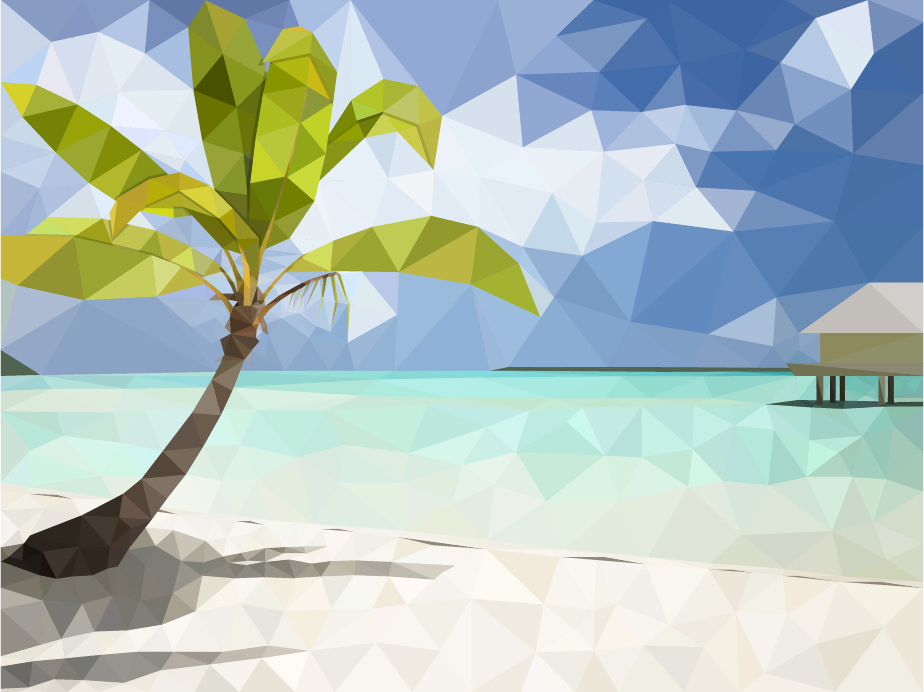

### Hi!

[

](./LowPolyBeach-01.jpg?raw=true)

My name is Nolan and I am a computer science student at the Georgia Institute of Technology. I have experience in various programming languages, including 🟦🟧Java, 🟦🟨Python, ⏹C/C++, ☑C#, ⬜JavaScript, 🔲SQL, and 🔶Swift, as well as experience in HTML/CSS, Electron + Node.js, AWS EC2/S3/DynamoDB/ECS, Selenium, PyTorch, Tensorflow, and more. If you are interested in my general skillset or would like to talk about one of my projects, please don't hesitate to reach out!
